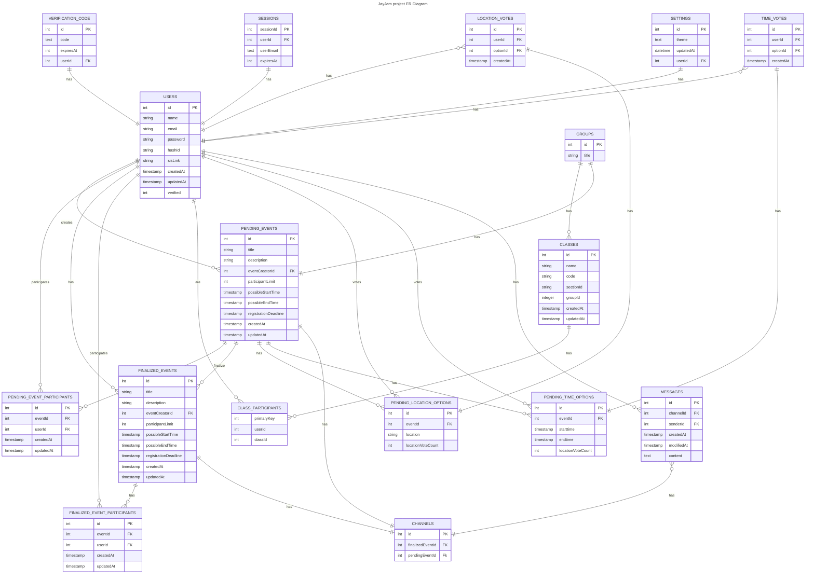

```mermaid
---
title: JayJam project ER Diagram
---

erDiagram
    USERS ||--o{ PENDING_EVENTS : creates
    USERS ||--o{ PENDING_EVENT_PARTICIPANTS : participates
    USERS ||--o{ FINALIZED_EVENTS : has
    USERS ||--o{ FINALIZED_EVENT_PARTICIPANTS : participates
    USERS ||--o{ CLASS_PARTICIPANTS : are
    USERS ||--o{ PENDING_LOCATION_OPTIONS : votes
    USERS ||--o{ PENDING_TIME_OPTIONS : votes
    USERS ||--o{ MESSAGES : has
    USERS {
        int id PK
        string name
        string email
        string password
        string hashId
        string sisLink
        timestamp createdAt
        timestamp updatedAt
        int verified
    }

    VERIFICATION_CODE ||--|| USERS : has
    VERIFICATION_CODE {
        int id PK
        text code 
        int expiresAt
        int userId FK
    }

    SESSIONS ||--|| USERS: has
    SESSIONS {
        int sessionId PK
        int userId FK
        text userEmail
        int expiresAt
    }

    SETTINGS ||--|| USERS: has
    SETTINGS {
        int id PK
        text theme 
        datetime updatedAt
        int userId FK
    }

    
    PENDING_EVENTS ||--o{ PENDING_EVENT_PARTICIPANTS : has
    PENDING_EVENTS ||--o{ FINALIZED_EVENTS : finalize
    PENDING_EVENTS ||--o{ PENDING_LOCATION_OPTIONS : has
    PENDING_EVENTS ||--o{ PENDING_TIME_OPTIONS : has
    PENDING_EVENTS ||--|| CHANNELS : has
    PENDING_EVENTS {
        int id PK
        string title
        string description
        int eventCreatorId FK
        int participantLimit
        timestamp possibleStartTime
        timestamp possibleEndTime
        timestamp registrationDeadline
        timestamp createdAt
        timestamp updatedAt
    }

    PENDING_LOCATION_OPTIONS {
        int id PK
        int eventId FK
        string location
        int locationVoteCount
    }

    PENDING_TIME_OPTIONS {
        int id PK
        int eventId FK
        timestamp starttime
        timestamp endtime
        int locationVoteCount
    }

    LOCATION_VOTES }o--|| USERS : has
    LOCATION_VOTES ||--|| PENDING_LOCATION_OPTIONS : has
    LOCATION_VOTES {
        int id PK
        int userId FK
        int optionId FK
        timestamp createdAt 
    }

    TIME_VOTES }o--|| USERS : has
    TIME_VOTES ||--|| PENDING_TIME_OPTIONS : has
    TIME_VOTES {
        int id PK
        int userId FK
        int optionId FK
        timestamp createdAt 
    }

    GROUPS ||--o{ CLASSES : has
    GROUPS ||--|| PENDING_EVENTS : has
    GROUPS {
        int id PK
        string title
    }
    
    CLASSES ||--o{ CLASS_PARTICIPANTS : has
    CLASSES {
        int id PK
        string name
        string code
        string sectionId
        integer groupId
        timestamp createdAt
        timestamp updatedAt
    }

    PENDING_EVENT_PARTICIPANTS {
        int id PK
        int eventId FK
        int userId FK
        timestamp createdAt
        timestamp updatedAt
    }
    
    CLASS_PARTICIPANTS {
        int primaryKey
        int userId
        int classId
    }

    FINALIZED_EVENTS ||--o{ FINALIZED_EVENT_PARTICIPANTS : has
    FINALIZED_EVENTS ||--|| CHANNELS : has
    FINALIZED_EVENTS {
        int id PK
        string title
        string description
        int eventCreatorId FK
        int participantLimit
        timestamp possibleStartTime
        timestamp possibleEndTime
        timestamp registrationDeadline
        timestamp createdAt
        timestamp updatedAt
    }

    FINALIZED_EVENT_PARTICIPANTS {
        int id PK
        int eventId FK
        int userId FK
        timestamp createdAt
        timestamp updatedAt
    }

    MESSAGES }o--|| CHANNELS : has
    MESSAGES {
        int id PK
        int channelId FK
        int senderId FK
        timestamp createdAt
        timestamp modifiedAt
        text content
    }

    CHANNELS {
        int id PK
        int finalizedEventId FK
        int pendingEventId Fk
    }
```
