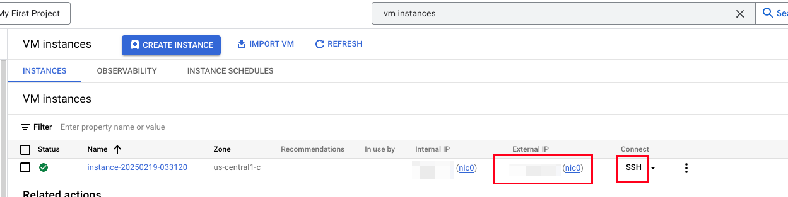
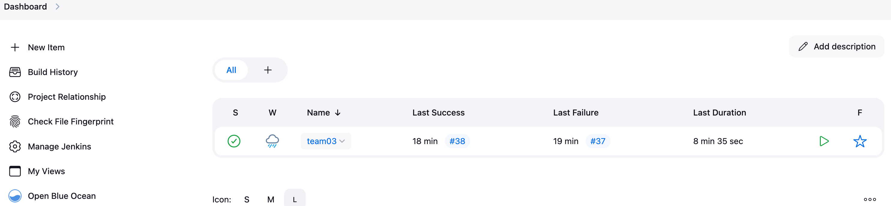
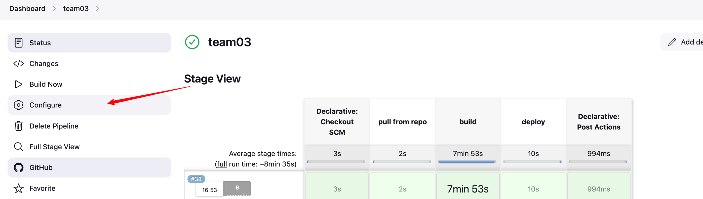
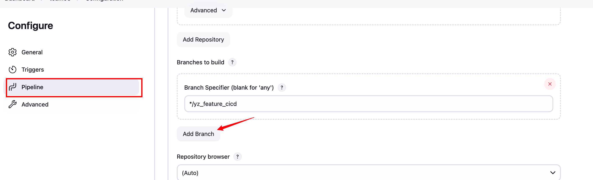
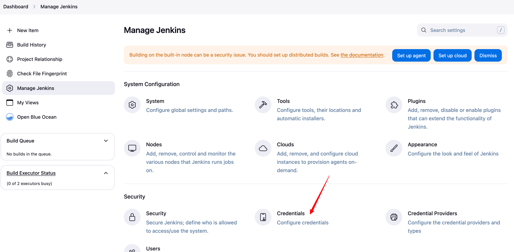
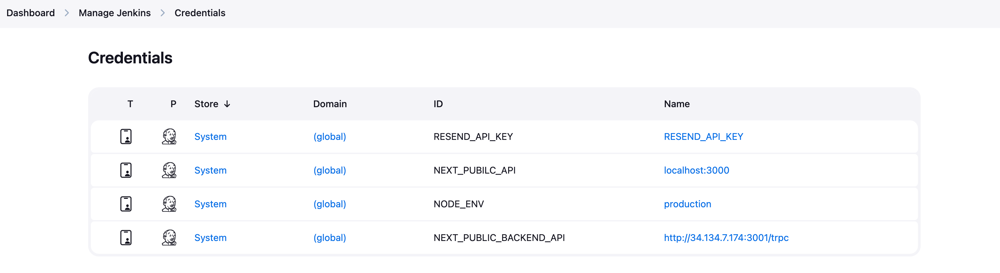

# Technical Documentation

## Introduction

### 1.1 Purpose

### 1.2 Scope

### 1.3 Audience

## System Overview

### 2.1 Architecture

### 2.2 Technologies Used

- [Playwright](https://playwright.dev/) for unit and end-to-end testing
- [Zod](https://zod.dev/) for schema validation

### 2.3 Dependencies

## Installation Guide

### 3.1 Prerequisites

- [Node.js](https://nodejs.org/) (v22.14.0)
- [Docker](https://www.docker.com/get-started/)
- [PNPM](https://pnpm.io/installation)
- [Next.js](https://nextjs.org/)

This project can run on Docker or locally. Both methods will require cloning the repository locally first, which requires Git to be installed before continuing.

### 3.2 System Requirements

- If you have a Windows machine, some of the package.json script commands such as ```rm``` may not work in the normal command line, so run them in another terminal such as Git Bash.

### 3.3 Installation Steps

### Cloning Repository

```
git clone https://github.com/cs421sp25-homework/team-03.git
```

Other options for cloning are through SSH and Github Desktop.

### Environment Setup

Follow [4.2 Environment Setup](#42-environment-setup)

<!-- ### Running on Docker

Make sure Docker is installed on your machine. Then `cd` into the root directory and run the following command:

```shell
pnpm docker:dev
```

Then you should be able to access the application at `http://localhost:3000` -->

### Running Locally

If you don't want to run it through Docker, you can also run it locally.

In the root directory, install dependencies then run the project:

```shell
pnpm install
pnpm dev
```

Then you should be able to access the application at `http://localhost:3002`

## Configuration Guide

### 4.1 Configuration Parameters

### 4.2 Environment Setup
#### Frontend
- The port for local devlopment is configured in `apps/client/package.json`. In `next dev` command, `3002` is used for development. 
- To connect to the backend server, two place need to pay attention to:
  - `apps/client/next.config.ts` (where mainly for config the url)
  - `apps/client/src/trpc/client.tsx` (where mainly for adding the `/trpc` suffix)

#### Backend
Duplicate `.env.example` as `.env` inside `apps/server`. Then fill in required `RESEND_API_KEY` keys.
  - using team email to sign in https://resend.com/ and get the API key.


### 4.3 External Services Integration

- **Resend** is used to send verification codes to users' emails. This service is integrated with our app via an API key allowing us to use the Resend API.

## Usage Guide

### 5.1 User Interface Overview

### 5.2 User Authentication

- Lastly, ensure all users are JHU students by having them verify that the @jhu.edu/@jh.edu address they entered is their's via verification code.

### 5.3 Core Functionality

### 5.4 Advanced Features

### 5.5 Troubleshooting

## API Documentation

### 6.1 Endpoints

- register procedure (publicly exposed as /auth/register):
  - Allow new users to register using JHU email and password
- login procedure (publicly exposed as /auth/login):
  - Allow existing users to login using JHU email and password
- logout procedure (protected as /auth/logout):
  - Allow logged in users to log out.
- requestPassReset (publically exposed as /auth/request-password-reset):
  - Allow users to request a password reset using JHU email
- resetPassword (protected as /auth/reset-password):
  - Let user enter in new password after email confirmation.
- sendVerificationCode procedure (exposed as /send-code for testing):
  - Send a verification code to the user's JHU email.
- verifyVerificationCode procedure (exposed as /verify-code for testing):
  - Verify the code inputted by the the user by checking the user's verfication code.

### 6.2 Request and Response Formats

### 6.3 Authentication and Authorization

Authentication is done by generating a token which is passed to client through a cookie. The token is also hashed into a sessionId and stored in the database linked to the user. When the user sends requests to the server, they will include the cookie containing the token. The token is hashed again, and if it matches a sessionId in the database, that user is authorized.

General Steps:

Authentication:

1. Existing user provides credentials
2. Credentials are passed to server
3. Server verifies credentials, and if correct:
4. Create a session token
5. Send to client through cookie
6. Hash token and store in database
7. User is logged in

Authorization:

1. Any requests to DB afterwards will include session cookie
2. Server gets token from cookie
3. Generate session id from token
4. User with that session id is authorized to perform requested action

Email Verification:
1. When the user's creates an account, the session will store the user's id and email. The database will store a verification code for the user.
2. They will be directed to a page where they are prompted to enter a verification code that was sent to their email
3. The code will be checked against the code in the database. The account will only be created if verfication is successful

## Database Schema

### 7.1 Entity-Relationship Diagram

### 7.2 Table Definitions

### 7.3 Relationships and Constraints

## Testing

- Backend tests are written in files in ```apps\server\src\tests```, frontend/E2E tests are written in ```apps\client\src\tests```.
- Run the tests by doing pnpm test in either ```apps\server``` (for backend) or ```apps\client``` (for frontend/E2E).

### 8.1 Test Plan

- Endpoints can be tested using Postman. Check if the response matches the expected response
- Endpoints will also be unit tested using Playwright.
- Frontend/E2E will be tested using Playwright.


### 8.2 Test Cases

### 8.3 Test Results

## Deployment

### 9.1 Deployment Process
The app is deployed on Google Cloud VM instance using `Jenkins`, `pm2` and `caddy`.
- Production Environment Link: https://team03.crabdance.com
- Test Environment Link: https://dev.team03.crabdance.com
- Jenkins Link: https://jenkins.team03.crabdance.com

Domain name is registered on https://freedns.afraid.org/.

#### Overview of deployment process
1. Connect Jenkins with Github repo using webhook.
2. Branch push or PR will trigger the pipeline job in Jenkins.
3. Two pipelines are used in this project. One for production environment and the other for test environment.
4. The pipeline will build the app using pnpm and start frontend and backend servers using pm2.
   - When building, some environment variable are used in Jenkins. These variables are passed in `Jenkinsfile`
      | Environment Variable | Description | Value |
      | -------------------- | ----------- | ----- |
      | FRONTEND_PORT(only in Jenkins) | Port for the frontend server | 3000 (prod) / 3002 (dev) |
      | BACKEND_PORT(only in Jenkins) | Port for the backend server | 4000 (prod) / 4002 (dev) |
      | NEXT_PUBLIC_FRONTEND_URL(in code and Jenkins) | URL for the frontend | Production or development URL |
      | NEXT_PUBLIC_BACKEND_API(in code and Jenkins) | URL for the backend API | (Production or development URL)/api/trpc |
      | NODE_ENV(in Jenkins and code)  | It is assigned according to the branch pushed, if the branch is `master`, it is `production`, otherwise it is `development` |"production" or "development"|
5. Caddy is used to reverse proxy the frontend and backend servers and parse to different domain names. The configuration file is in `/etc/caddy/Caddyfile`, using `sudo vim` to edit the file.
6. The app will be accessible through the domain name.


#### Google Cloud VM instance
1. using team email to login https://console.cloud.google.com/
2. In the top center search bar, search "VM instances"
3. Then you will see the VM instances dashboard, there is a entry with VM instance's name and IP. 
4. Take a look at the external IP. The external IP can be access through the internet.


#### Jenkins
1. The Jenkins is on the port 8080. That means you can access it by http://[external-ip]:8080. Please replace [external-ip] with the actual external IP.
2. The default username is admin and password is team eamil's password.
3. After login, you can see the dashboard. There should be only one pipeline job named "team03".

4. Click the job name, then you can see the pipeline job page. On the left side of the page, you configure the pipeline job. Click "Configure" to configure the pipeline job.

5. Scroll down to the "Pipeline" section. You can add branch source to trigger the pipeline job when a branch pushed.

6. Environment variables are stored in the "Manage Jenkins" -> "Credentials"

7. Click `(global)` to add global credentials.


Four environment variables are used in the code of this project. 
1. RESEND_API_KEY	RESEND_API_KEY: It is store in the "credentials" section of Jenkins configuration page.
2. NEXT_PUBLIC_BACKEND_URL: It is assigned according to the branch pushed, if the branch is `master`, it is `https://team03.crabdance.com/api/trpc`, otherwise it is `https://dev.team03.crabdance.com/api/trpc`. To use the open api, just use `domainName/api`.  
3. NEXT_PUBLIC_FRONTEND_URL: It is assigned according to the branch pushed, if the branch is `master`, it is `https://team03.crabdance.com`, otherwise it is `https://dev.team03.crabdance.com`.
4. NODE_ENV: It is assigned according to the branch pushed, if the branch is `master`, it is `production`, otherwise it is `development`.


### 9.2 Release Notes

### 9.3 Known Issues and Limitations
The storage of the VM instance is limited. So we may need to clean the workspace and tmp files regularly.
```
sudo find /var/lib/jenkins/workspace -name "node_modules" -type d -exec rm -rf {} \; 2>/dev/null
sudo find /var/lib/jenkins/workspace -name "**.tmp" -delete
sudo systemctl restart jenkins

# command to check the size of the workspace
sudo du -h --max-depth=1 /var/lib/jenkins/workspace/team03 | sort -hr
```
(not really figure out how to clean the workspace and tmp files regularly)


## Glossary

### 10.1 Terms and Definitions