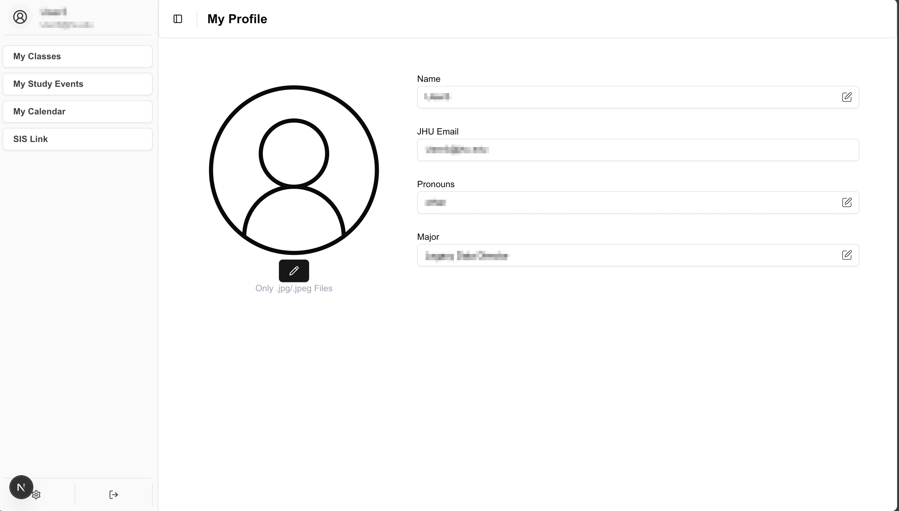

# Technical Documentation

## Introduction

### 1.1 Purpose
The purpose of this app is to help students easily form groups with their classmates and decide on optimal meeting times. Many students may be too shy to form study groups in their classes, so the app automatically places students in groups by class. In addition, it provides many tools to simply the selection of group meeting dates, times, and locations.

### 1.2 Scope
This app is functional but operates on a small scale.

### 1.3 Audience

The audience is Johns Hopkins University students.

## System Overview

### 2.1 Architecture

### 2.2 Technologies Used

- [Playwright](https://playwright.dev/) for unit and end-to-end testing
- [Zod](https://zod.dev/) for schema validation
- [Resend](https://resend.com/) for emailing user verification codes
- [Google APIs](https://www.npmjs.com/package/googleapis) for Google Calendar integration 

### 2.3 Dependencies

## Installation Guide

### 3.1 Prerequisites

- [Node.js](https://nodejs.org/) (v22.14.0)
- [Docker](https://www.docker.com/get-started/)
- [PNPM](https://pnpm.io/installation)
- [Next.js](https://nextjs.org/)

This project can run on Docker or locally. Both methods will require cloning the repository locally first, which requires Git to be installed before continuing.

### 3.2 System Requirements

- If you have a Windows machine, some of the package.json script commands such as ```rm``` may not work in the normal command line, so run them in another terminal such as Git Bash.

### 3.3 Installation Steps

### Cloning Repository

```
git clone https://github.com/cs421sp25-homework/team-03.git
```

Other options for cloning are using SSH and Github Desktop.

### Environment Setup

Follow [4.2 Environment Setup](#42-environment-setup)

<!-- ### Running on Docker

Make sure Docker is installed on your machine. Then `cd` into the root directory and run the following command:

```shell
pnpm docker:dev
```

Then you should be able to access the application at `http://localhost:3000` -->

### Running Locally

If you don't want to run it through Docker, you can also run it locally.

In the root directory, install dependencies then run the project:

```shell
pnpm install
pnpm dev
```

Then you should be able to access the application at `http://localhost:3002`

## Configuration Guide

### 4.1 Configuration Parameters

### 4.2 Environment Setup
#### Frontend
- The port for local devlopment is configured in `apps/client/package.json`. In the `next dev` command, `3002` is used for development. 
- To connect to the backend server, there are two places you should focus on:
  - `apps/client/next.config.ts` (mainly for configuring the url)
  - `apps/client/src/trpc/client.tsx` (mainly for adding the `/trpc` suffix)

#### Backend
Duplicate `.env.example` as `.env` inside `apps/server`. Then fill in a `RESEND_API_KEY` key.
  - use the team email to sign at https://resend.com/ and get the API key.


### 4.3 External Services Integration

- **Resend** is used to send verification codes to users' emails. This service is integrated with our app via an API key allowing us to use the Resend API.

- **Google APIs** are used to allow users to import their Google calendar events into the app.

## Usage Guide

### 5.1 User Interface Overview
- User Authentication
  - Login page
     The login page allows existing users to authenticate with their JHU email and password.

  - Register page
     New users can create an account with their JHU email address.

  - Forgot Password page
     Users can request a password reset if they've forgotten their credentials.
  
- My Calendar Page
   
  - The dashboard is the main page of the app. It displays the user's profile information and their agenda.
  - The global sidebar can route to different pages of the app.

- Profile
  
  - The profile page allows users to view and edit their profile information.
  - Users can edit their name, major, pronouns, and profile picture.

- Settings
  
  - The settings page allows users to configure their app preferences.
  - Users can toggle between light and dark mode.

- Classes Page
  
  - The classes page allows users to view and manage their classes.
  - Users can add a class by entering their SIS link.
  - Users can hide a class by clicking the hide icon.
  - Users can view their classes details by clicking the details button.
 
  - The classes details page allows users to view their classesmate and events in this class.
  - Users can create study events in the class

- Study Events Page
  
  - The study events page allows users to view and manage their study events.


### 5.2 User Authentication
- User need to register with their JHU email address
- after registration, user need to verify their email by entering the verification code sent to their email
- after verification, user can login with their JHU email and password
- If the user is not verified, they need to verify their email again by reset-password page.

### 5.3 Core Functionality
The main functionality of the app is to allow users to create study events and view them in their calendar. So the core functionality is around event management.

- Create Event
  Any student in their class can create a study event. 
  

  In the "Class detail" page, users can create a study event by clicking the "Create Event" button. The "create event" dialog will be shown. In this dialog, users can enter the event details including:
  - Event name
  - Event description
  - Possible meeting times
  - Event registration deadline
  - Event participants limit
  Once the event is created, it will be shown in the "Study Events" page and "Class detail" page. The event now is under "Pending" status.

- Edit Event
  The creator of pending event can edit the event details, including:
  - Event name
  - Event description
  - Possible meeting times
  - Event registration deadline
  - Event participants limit
  - Event location options
  - Event timeslot options
  Through providing these information, potential participants can view the event details and register for it.

- Delete participants
  As a creator wef

- Join Event
  Once the event is created, potential participants can join the event by clicking the "Join" button in the "Study Events" page.


- Vote for options
  After joining the event, the participant can vote and devote for the event location options and timeslot options.

- Finialize the event 
  After people join the event and vote for the options, the event creator can finalize the event. For the options, event creator can choose the best option and the best timeslot for events. Once the event is finalized, the event has "Finalized" status. 
  The finalized event will be shown on "study events" page and "class detail" page.
  Once the event is finalized, the event will be shown on the participant's calendar.

- Leave Event
  The participant can leave the event by clicking the "Leave" button in the "Study Events" page or "Class detail" page. No matter the event is finalized or not, the participant can leave the event.

### 5.4 Advanced Features

- Real-time messaging 
  The participant in a study event can send message to all other participants in the event, no matter the event is finalized or not. What's more, participant can edit or delete their message, and they can also react to other's message.

### 5.5 Troubleshooting

## API Documentation

### 6.1 Endpoints

- register procedure (publicly exposed as /auth/register):
  - Allow new users to register using JHU email and password
- login procedure (publicly exposed as /auth/login):
  - Allow existing users to login using JHU email and password
- logout procedure (protected as /auth/logout):
  - Allow logged in users to log out.
- requestPassReset (publically exposed as /auth/request-password-reset):
  - Allow users to request a password reset using JHU email
- resetPassword (protected as /auth/reset-password):
  - Let user enter in new password after email confirmation.
- sendVerificationCode procedure (exposed as /send-code for testing):
  - Send a verification code to the user's JHU email.
- verifyVerificationCode procedure (exposed as /verify-code for testing):
  - Verify the code inputted by the the user by checking the user's verfication code.

### 6.2 Request and Response Formats

### 6.3 Authentication and Authorization

Authentication is done by generating a token which is passed to client through a cookie. The token is also hashed into a sessionId and stored in the database linked to the user. When the user sends requests to the server, they will include the cookie containing the token. The token is hashed again, and if it matches a sessionId in the database, that user is authorized.

General Steps:

Authentication:

1. Existing user provides credentials
2. Credentials are passed to server
3. Server verifies credentials, and if correct:
4. Create a session token
5. Send to client through cookie
6. Hash token and store in database
7. User is logged in

Authorization:

1. Any requests to DB afterwards will include session cookie
2. Server gets token from cookie
3. Generate session id from token
4. User with that session id is authorized to perform requested action

Email Verification:
1. When the user's creates an account, the session will store the user's id and email. The database will store a verification code for the user.
2. They will be directed to a page where they are prompted to enter a verification code that was sent to their email
3. The code will be checked against the code in the database. The account will only be created if verfication is successful

## Database Schema

### 7.1 Entity-Relationship Diagram

- Refer to it [here](ER-diagram.md)

### 7.2 Table Definitions

- Groups - Groups within the app, can contain 1 or more classes
- Classes - Course at Hopkins (different sections are considered different classes)
- Users - Students that use the application (must have a "jhu.edu" or "jh.edu" email)
- Class Participants - Members of a class
- Finalized Events - Events that have had the time and location finalized and are entered on users' calenders
- Pending Events - Events that are part of a group and not finalized yet (users can still join and vote for time and location options)
- Finalized Event Participants - Members of a finalized event
- Pending Event Participants - Members of a pending event
- Pending Location Options - Location options that can be voted on for a pending event
- Pending Time Options - Time options that can be voted on for a pending event
- Location Votes - Votes for a certain location for a certain pending event
- Time Votes - Votes for a certain time slot for a certain pending event
- Verification Code - Emailed to users to confirm their identity
- Sessions - Browser session
- Settings - User preferences for a user
- Channels - Contain chat messages
- Messages - Chat messages sent by users
- Message Reactions - Emoji reactions on messages made by users
- Banned Users - Users not allowed to join a pending event


### 7.3 Relationships and Constraints
- Groups
  - 1 group can have many classes
- Classes
  - 1 class can have many class participants
  - 1 class belongs to exactly 1 group
- Users
  - 1 user can be many class participants (can be a member of multiple classes)
  - 1 user has 1 setting table (own user preferences)
- Class Participants
  - Many class participants in 1 class
  - Many class participants can be the same user (since user can be a member of multiple classes)
- Pending Events
  - 1 pending event can have many pending event participants
  - 1 pending event can have many pending location options
  - 1 pending event can have many pending time options
  - Many pending events can be associated to the same group
- Pending Event Participants
  - Many pending event participants for 1 pending event
  - Many pending event participants can be the same user
- Pending Location Options
  - Many pending location options for 1 pending event
- Pending Time Options
  - Many pending time options for 1 pending event
- Finalized Events
  - 1 finalized event can have many finalized event participants
- Finalized Event Participants
  - Many finalized event participants are part of 1 finalized event
  - Many finalized event participants can be the same user
- Settings
  - 1 setting for 1 user
- Messages
    - 1 user for every message
    - Many messages for 1 user
- Message reactions
    - 1 user for every reaction
    - Many reactions for 1 user
## Testing

- Backend tests are written in files in ```apps\server\src\tests```
- Frontend/E2E tests are written in ```apps\client\src\tests```.
- Run the tests with ```pnpm test``` in either ```apps\server``` (for backend) or ```apps\client``` (for frontend/E2E).

### 8.1 Test Plan


- Backend TRPC procedures are tested using Playwright
- Frontend/E2E are tested using Playwright.
- To run tests:
   - Backend tests:
    ```
    cd apps/server
    pnpm test
    ```
   - Frontend/E2E tests:
    ```
    cd apps/client
    pnpm test
    ```
- Specific test files can also be run by adding the file name after ``` test ```
### 8.2 Test Cases
 - Frontend:
    - Verify Page: The VerifyPage tests include checking that the page renders properly with the correct heading and email pre-filled, verifying that sending a verification code correctly triggers a resend timer state, ensuring six-digit code inputs are available and can be filled, confirming that submitting a correct verification code redirects the user to the /calendar page, and handling invalid code submissions by displaying appropriate error feedback.

#### Backend

##### auth.route.spec.ts
- Send the verfication code to the user is successful
- Ensure verification code check is successful when the user enters the right code
- Ensure verify code check throws error when it does not match from user
- Ensure verify code check throws error when it is expired
- Ensure validate session valdiates a session that exists
- Ensure validate session invaldiates a non-existent session
- Ensure reset code check is successful when the user enters the right code
- Ensure reset code check throws error when it does not match from user
- Ensure reset code check throws error when it is expired
- Ensure reset password works

##### chat.route.spec.ts
- Create chat is successful with finalizedEventId not null and pendingEventId null
- Create chat is successful with pendingEventId not null and finalizedEventId null
- Create chat is fails with pendingEventId null and finalizedEventId null
- getAdmin is successful when given a valid channelId
- getAdmin fails when given an invalid channelId

##### events.route.spec.ts
- Give user suggested times based on non-empty existing date input where dates are all on the same day
- Give user suggested times based on non-empty existing date input where available interval ends before existing dates interval; all dates are on the same day
- Give user suggested times based on non-empty existing date input where both sets of dates are not on the same day
- Randomly generated event time suggestion case 1
- Randomly generated event time suggestion case 2
- Get user schedules based on the eventID where the event has participants
- Remove event participant successfully
- Remove event participant fails due to non-existent event
- Remove event participant fails due to invalid session
- Remove event participant fails due to something that should never happen

##### message.route.spec.ts
- Create message works correctly with correct input and non-null finalizedEventId
- Create message works correctly with correct input and non-null pendingEventId
- Create message fails when done by unauthorized user
- Delete message works correctly with correct input in a finalized event channel
- Delete message works correctly with correct input in a pending event channel
- Delete message fails with incorrect id input
- Delete message fails with invalid session
- Delete message fails with creator user mismatch
- Delete message succeeds with creator user mismatch but user is event creator

##### events.voting.test.ts

- Add a participant to the event
- Vote for a time option
- Vote for a location option
- Unvote for a location option
- Get all location options for a pending event
- Delete a location option
- Finalize the event

##### profile.spec.ts

- Change name
- Ensure unable to change name with invalid input
- Change major
- Change pronouns
- Change profile picture

#### Frontend/E2E

##### signup.spec.ts
- should render the signup form
- should show error for invalid email
- Ensure register email is case insensitive
- Ensure register email is case insensitive 2
- should show error when passwords do not match
- should validate weak password
- should toggle password visibility
- should allow navigation to login page

##### myevents.spec.ts

- Ensure successful leave event flow is working
- Ensure successful cancel leave event flow is working from cancel button
- Ensure successful cancel leave event flow is working from click outside dialog

##### reset.spec.ts
- Ensure basic reset password flow is correctly working
- Ensure reset password flow with resend code is correctly working
- Ensure reset password does not proceed if incorrect confirm password is entered
- Ensure reset password does not proceed if incomplete verification code is entered

##### delete.message.spec.ts

- Ensure basic delete message flow is working
- Ensure cancel delete message flow is working with cancel button
- Ensure cancel delete message flow is working by clicking outside


### 8.3 Test Results
 - Frontend:
    - Verify Page: The tests successfully validate all major VerifyPage functionalities, including page rendering, sending and resending verification codes, entering verification codes, redirecting after successful verification, and displaying errors for invalid codes. While the main flows are fully covered, dynamic frontend behaviors like live countdown progression and loading states are simulated rather than deeply tested, providing strong coverage of user-facing interactions with some areas left for future improvement.

#### Backend

##### auth.route.spec.ts
- Send the verfication code to the user is successful: Pass
- Ensure verification code check is successful when the user enters the right code: Pass
- Ensure verify code check throws error when it does not match from user: Pass
- Ensure verify code check throws error when it is expired: Pass
- Ensure validate session valdiates a session that exists: Pass
- Ensure validate session invaldiates a non-existent session: Pass
- Ensure reset code check is successful when the user enters the right code: Pass
- Ensure reset code check throws error when it does not match from user: Pass
- Ensure reset code check throws error when it is expired: Pass
- Ensure reset password works: Pass

##### chat.route.spec.ts
- Create chat is successful with finalizedEventId not null and pendingEventId null: Pass
- Create chat is successful with pendingEventId not null and finalizedEventId null: Pass
- Create chat is fails with pendingEventId null and finalizedEventId null: Pass
- getAdmin is successful when given a valid channelId: Pass
- getAdmin fails when given an invalid channelId: Pass

##### events.route.spec.ts
- Give user suggested times based on non-empty existing date input where dates are all on the same day: Pass
- Give user suggested times based on non-empty existing date input where available interval ends before existing dates interval: Pass
- Give user suggested times based on non-empty existing date input where both sets of dates are not on the same day: Pass
- Randomly generated event time suggestion case 1: Pass
- Randomly generated event time suggestion case 2: Pass
- Get user schedules based on the eventID where the event has participants: Pass
- Remove event participant successfully: Pass
- Remove event participant fails due to non-existent event: Pass
- Remove event participant fails due to invalid session: Pass
- Remove event participant fails due to something that should never happen: Pass

##### message.route.spec.ts
- Create message works correctly with correct input and non-null finalizedEventId: Pass
- Create message works correctly with correct input and non-null pendingEventId: Pass
- Create message fails when done by unauthorized user: Pass
- Delete message works correctly with correct input in a finalized event channel: Pass 
- Delete message works correctly with correct input in a pending event channel: Pass
- Delete message fails with incorrect id input: Pass
- Delete message fails with invalid session: Pass
- Delete message fails with creator user mismatch: Pass
- Delete message succeeds with creator user mismatch but user is event creator: Pass


##### events.voting.test.ts

- Add a participant to the event: Pass
- Vote for a time option: Pass
- Vote for a location option: Pass
- Unvote for a location option: Pass
- Get all location options for a pending event: Pass
- Delete a location option: Pass
- Finalize the event: Pass


#### Frontend/E2E

##### signup.spec.ts
- should render the signup form
- should show error for invalid email
- Ensure register email is case insensitive
- Ensure register email is case insensitive 2
- should show error when passwords do not match
- should validate weak password
- should toggle password visibility
- should allow navigation to login page

##### myevents.spec.ts

- Ensure successful leave event flow is working: Pass
- Ensure successful cancel leave event flow is working from cancel button: Pass
- Ensure successful cancel leave event flow is working from click outside dialog: Pass

##### reset.spec.ts
- Ensure basic reset password flow is correctly working: Pass
- Ensure reset password flow with resend code is correctly working: Pass
- Ensure reset password does not proceed if incorrect confirm password is entered: Pass
- Ensure reset password does not proceed if incomplete verification code is entered: Pass

##### delete.message.spec.ts

- Ensure basic delete message flow is working: Pass
- Ensure cancel delete message flow is working with cancel button: Pass
- Ensure cancel delete message flow is working by clicking outside: Pass

## Deployment

### 9.1 Deployment Process
The app is deployed on Google Cloud VM instance using `Jenkins`, `pm2` and `caddy`.
- Production Environment Link: https://team03.crabdance.com
- Fallback Production Environment Link: https://team03.hopto.org
- Development Environment Link: https://dev.team03.crabdance.com
- Jenkins Link: https://jenkins.team03.crabdance.com

Domain name is registered on https://freedns.afraid.org/ and http://freeddns.noip.com/

#### Overview of deployment process
1. Connect Jenkins with Github repo using webhook.
2. Branch push or PR will trigger the pipeline job in Jenkins.
3. Two pipelines are used in this project. One for production environment and the other for test environment.
4. The pipeline will build the app using pnpm and start frontend and backend servers using pm2.
   - When building, some environment variable are used in Jenkins. These variables are passed in `Jenkinsfile`
      | Environment Variable | Description | Value |
      | -------------------- | ----------- | ----- |
      | FRONTEND_PORT(only in Jenkins) | Port for the frontend server | 3000 (prod) / 3002 (dev) |
      | BACKEND_PORT(only in Jenkins) | Port for the backend server | 4000 (prod) / 4002 (dev) |
      | NEXT_PUBLIC_FRONTEND_URL(in code and Jenkins) | URL for the frontend | Production or development URL |
      | NEXT_PUBLIC_BACKEND_API(in code and Jenkins) | URL for the backend API | (Production or development URL)/api/trpc |
      | NODE_ENV(in Jenkins and code)  | It is assigned according to the branch pushed, if the branch is `master`, it is `production`, otherwise it is `development` |"production" or "development"|
5. Caddy is used to reverse proxy the frontend and backend servers and parse to different domain names. The configuration file is in `/etc/caddy/Caddyfile`, using `sudo vim` to edit the file.
6. The app will be accessible through the domain name.


#### Google Cloud VM instance
1. using team email to login https://console.cloud.google.com/
2. In the top center search bar, search "VM instances"
3. Then you will see the VM instances dashboard, there is a entry with VM instance's name and IP. 
4. Take a look at the external IP. The external IP can be access through the internet.


#### Jenkins
1. The Jenkins is on the port 8080. That means you can access it by http://[external-ip]:8080. Please replace [external-ip] with the actual external IP.
2. The default username is admin and password is team eamil's password.
3. After login, you can see the dashboard. There should be only one pipeline job named "team03".

4. Click the job name, then you can see the pipeline job page. On the left side of the page, you configure the pipeline job. Click "Configure" to configure the pipeline job.

5. Scroll down to the "Pipeline" section. You can add branch source to trigger the pipeline job when a branch pushed.

6. Environment variables are stored in the "Manage Jenkins" -> "Credentials"

7. Click `(global)` to add global credentials.


Four environment variables are used in the code of this project. 
1. RESEND_API_KEY	RESEND_API_KEY: It is store in the "credentials" section of Jenkins configuration page.
2. NEXT_PUBLIC_BACKEND_URL: It is assigned according to the branch pushed, if the branch is `master`, it is `https://team03.crabdance.com/api/trpc`, otherwise it is `https://dev.team03.crabdance.com/api/trpc`. To use the open api, just use `domainName/api`.  
3. NEXT_PUBLIC_FRONTEND_URL: It is assigned according to the branch pushed, if the branch is `master`, it is `https://team03.crabdance.com`, otherwise it is `https://dev.team03.crabdance.com`.
4. NODE_ENV: It is assigned according to the branch pushed, if the branch is `master`, it is `production`, otherwise it is `development`.


### 9.2 Release Notes
#### Iteration 1
- Establishing the tech stack and ensuring verification.
- JHU email authentication system ensuring that only JHU students can access the platform
- Email verification process to confirm JHU student status
- SIS iCal link integration for automatic class group joining
- Secure logout functionality for account protection on shared devices
#### Iteration 2
- Ensuring proper communication with SIS calendar links to add students to class groups.
- Google Calendar integration for automatic availability tracking
- Smart meeting time suggestions based on group availability
- Easy navigation between class groups created from your SIS link
- Class notification management (muting functionality)
- Customizable user profiles with name, picture, and additional information
- Light and dark mode toggle (bonus feature)
#### Iteration 3
- Study session creation with customizable details
- Participant limits to ensure appropriate group sizes
- Location suggestion and voting system
- Ability to leave events when plans change
- Personal calendar integration for automatic availability updates (bonus feature)
- Various bug fixes and improvements
#### Iteration 4
- Real-time messaging updates for instant communication
- Message deletion for managing communication
- Message editing for correcting sent messages
- Message search functionality for finding past information
- Reaction and emoji functionality for better communication


### 9.3 Known Issues and Limitations
#### 1. The storage of the VM instance is limited. So we may need to clean the workspace and tmp files regularly.
```
sudo find /var/lib/jenkins/workspace -name "node_modules" -type d -exec rm -rf {} \; 2>/dev/null
sudo find /var/lib/jenkins/workspace -name "**tmp" -delete
sudo systemctl restart jenkins

# command to check the size of the workspace
sudo du -h --max-depth=1 /var/lib/jenkins/workspace/team03 | sort -hr
```
#### 2. Since the VM instance is on lowest configuration, the performance of the VM instance is not very good. If there are too many push request to the repo, the VM instance may be frozen and need to manually restart it.


## Glossary

### 10.1 Terms and Definitions
